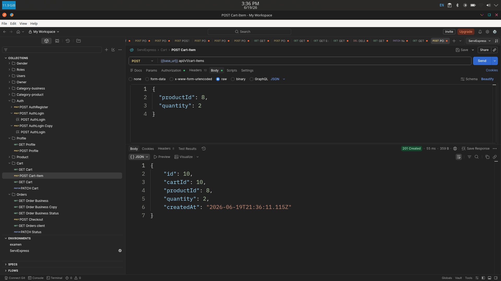
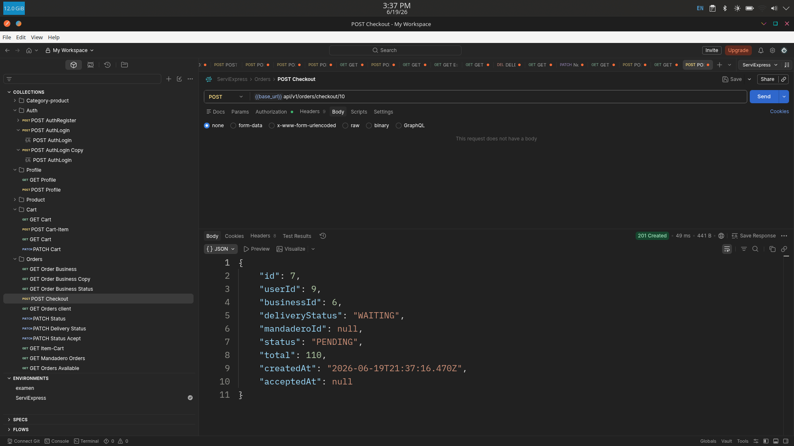
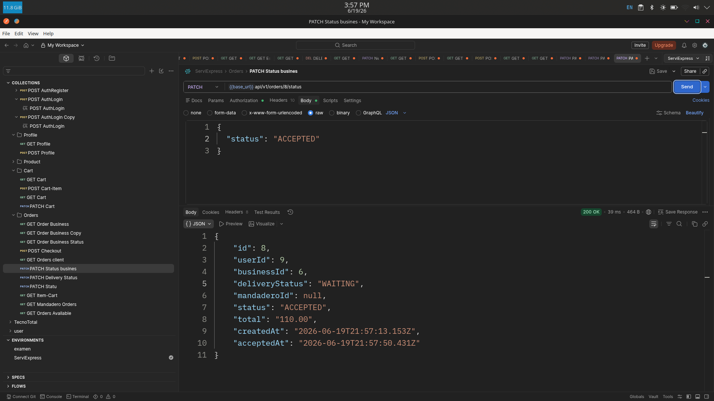
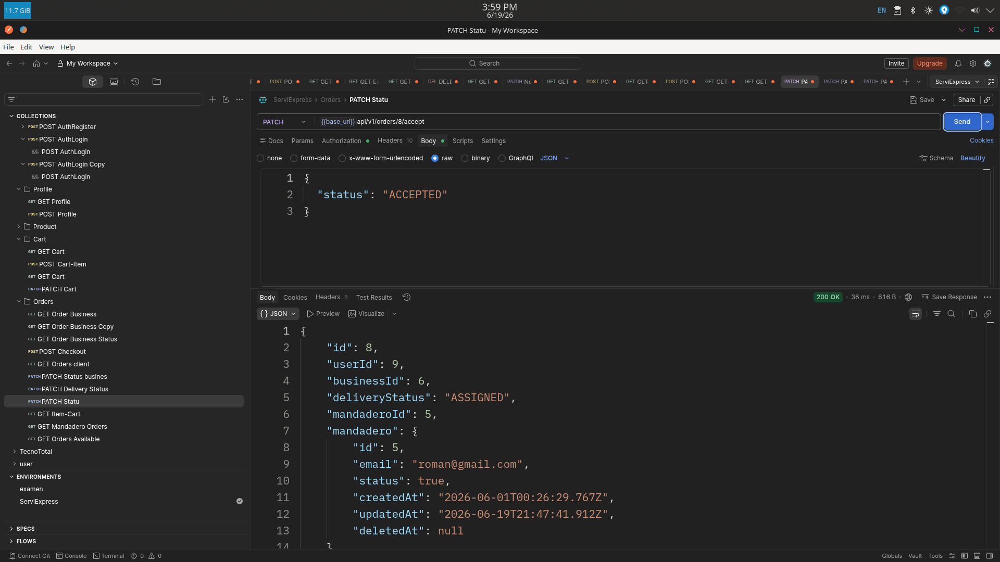
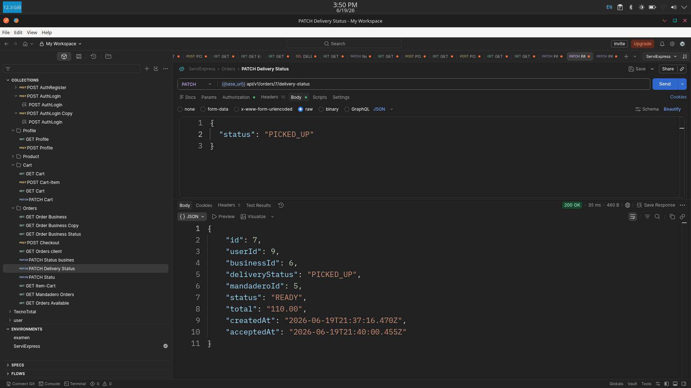
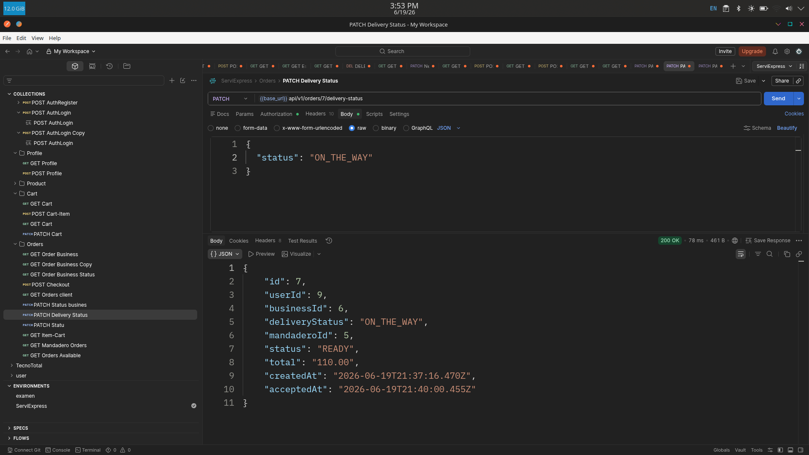
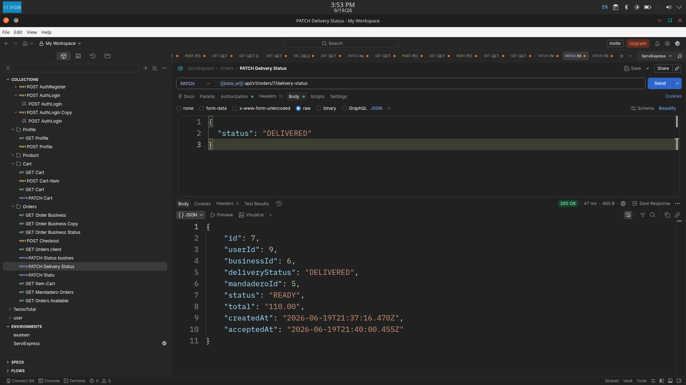

<p align="center">
  
</p>

<h1 align="center">SERVIEXPRESS Backend</h1>

Backend construido con NestJS, TypeORM y PostgreSQL para la gestión de usuarios, negocios, productos y sistema de pedidos con asignación de mandaderos.


<p align="center">
  
  
  
  
  
  
</p>


## Tecnologías utilizadas
- NestJS
- TypeORM
- PostgreSQL
- JWT Authentication
- Bcrypt
- Class Validator
- Multer
- REST API


## Instalación

```bash
# Clonar Repositorio mediante HTTPS

$ git clone https://github.com/SERVIEXPRESS-URACCAN/api-backend.git

# Mediante SSH  
$ git clone https://github.com/SERVIEXPRESS-URACCAN/api-backend.git
```

```bash
#Ingresar al directorio del proyecto:
 cd api-backend
```
```bash
#Instalar Dependencias
$ npm install
```

## Ejecución

```bash
# development
$ npm run start

# watch mode
$ npm run start:dev

# production mode
$ npm run start:prod
```

## Configuración de Variables de Entorno

Crear un archivo .env.local en la raíz del proyecto:

```text
- DB_HOST=localhost
- DB_PORT=5432
- DB_USER=
- DB_PASSWORD=
- DB_NAME=serviexpress

- JWT_SECRET=secret_key
- JWT_EXPIRES=1d

- PORT=3000
```

## Estructura del proyecto
```text
src/
├── common
├── module/
│   ├── auth/
│   ├── business/
│   ├── cart/
│   ├── cart-item/
│   ├── categories-business/
│   ├── categories-products/
│   ├── city/
│   ├── gender/
│   ├── mandadero/
│   ├── motorcycles/
│   ├── order/
│   ├── order-items/
│   ├── owner/
│   └── profile/
│   └── roles/
│   └── user-roles/
│   └── users/

```


### Descripción de carpetas

| Carpeta | Descripción |
|----------|-------------|
| common   | Código reutilizable global (dto, enum, helper) |
| module   | Módulos principales del sistema (auth, users, business, orders, etc.) |
| auth     | Autenticación y JWT (login, register, guards) |
| users    | Gestión de usuarios |
| roles    | Control de roles y permisos |
| profile  | Información de perfil del usuario |
| gender   | Gestión de géneros |
| mandadero | Gestión de repartidores |
| motorcycle  | Gestión de la moto del mandadero |
| business | Gestión de negocios |
| categories | Categorías de negocios y productos |
| products | Gestión de productos |
| cart     | Lógica del carrito de compras |
| orders   | Sistema de pedidos |
| admin    | Funcionalidades administrativas |


## Roles del sistema
- Administrador
- Gestiona usuarios
- Gestiona negocios
- Gestiona pedidos
- Gestiona mandaderos
- Gestiona propietarios


## Propietario
- Administra su negocio
- Gestiona productos
- Gestiona pedidos


## Mandadero
- Visualiza pedidos disponibles
- Acepta pedidos
- Actualiza estados de entrega

## Cliente
- Explora negocios
- Realiza pedidos
- Da seguimiento a órdenes


## Sistema de pedidos
- Flujo del pedido

- Cliente crea pedido
        
- Negocio acepta pedido
        
- Pedido pasa a disponibles
        
- Mandadero lo toma
        
- Pedido entregado

## Estados del pedido
- PENDING
- ACCEPTED
- PREPARING
- READY
- CANCELLED


## DELIVERY STATUS
- WAITING
- ASSIGNED
- PICKED_UP
- ON_THE_WAY
- DELIVERED


## Endpoints principales

```text
POST   /api/v1/auth/login
POST   /api/v1/auth/register

GET    /api/v1/users
GET    /api/v1/business
POST   /api/v1/business

GET    /api/v1/products
POST   /api/v1/products

GET    /api/v1/orders
POST   /api/v1/orders
PATCH  /api/v1/orders/status
```

## Funcionalidades técnicas
- Validaciones con DTOs (class-validator)
- Relaciones con TypeORM
- Manejo de transacciones en pedidos
- Soft delete (deletedAt)
- Upload de archivos con Multer

## Optimización
- Queries optimizadas con QueryBuilder
- Relaciones 
- Paginación 
- Validación de datos


##  Pruebas de la API
A continuación se muestran algunas pruebas realizadas mediante Postman para validar el funcionamiento de los pedidos


### Agregando productos al carrito para hacer la orden

<p align="center">
  
</p>

---

### Confirmando el Pedido

<p align="center">
  
</p>

---

### Aceptar pedido por negocio

<p align="center">
  
</p>

### Aceptar pedido por mandadero

<p align="center">
  
</p>

### Recoger Pedido

<p align="center">
  
</p>

### En Camino
<p align="center">
  
</p>

### Entregado
<p align="center">
  
</p>


Este backend forma parte del sistema SERVIEXPRESS, una plataforma de delivery que conecta clientes, negocios y mandaderos.
